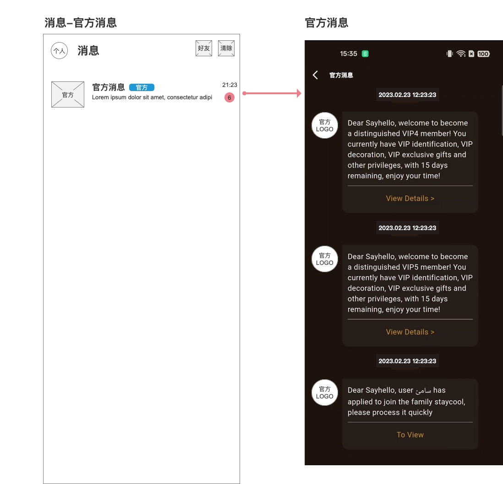
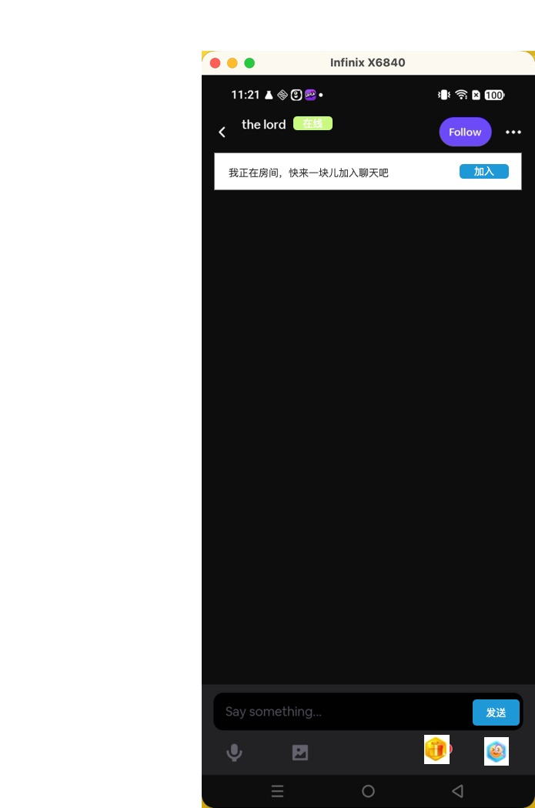
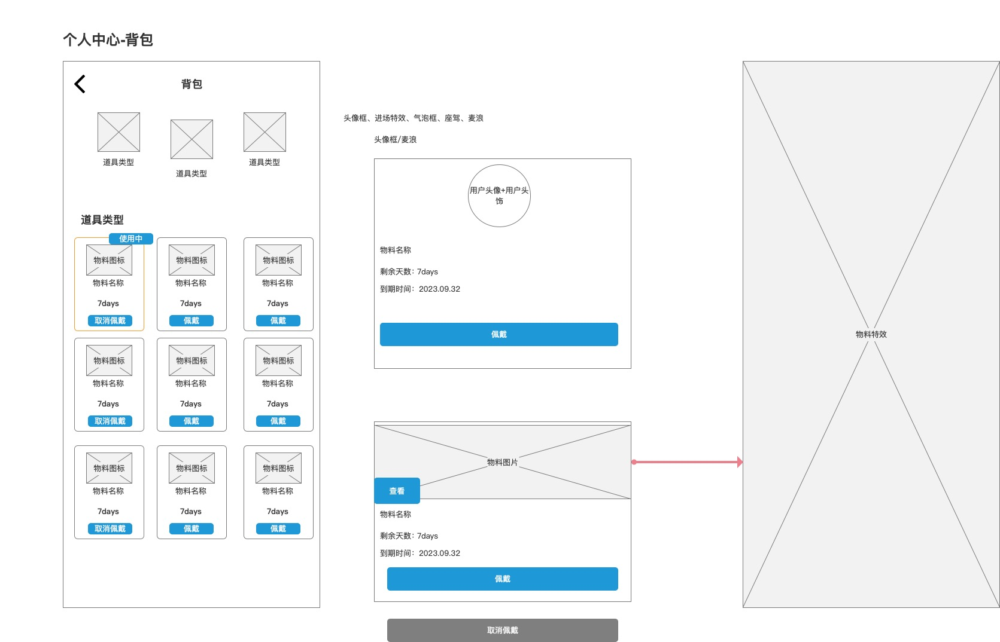
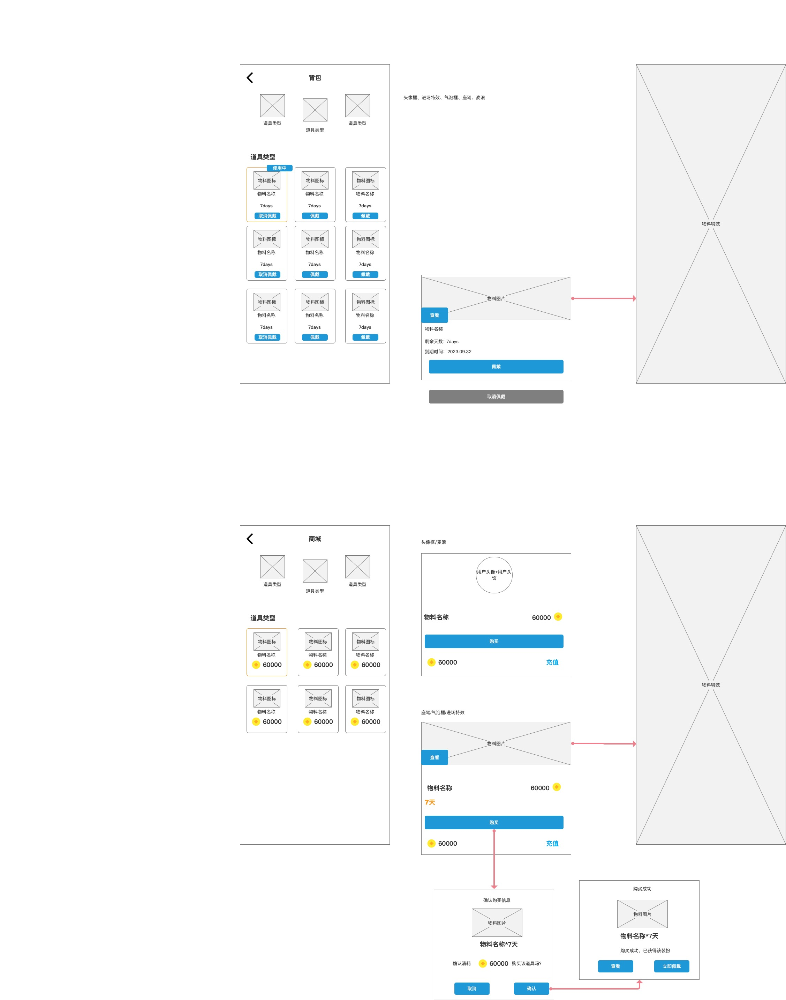
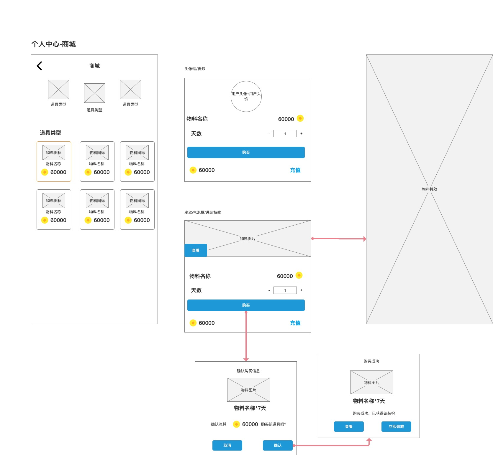

# V3 消息社交与成长消费版

> 来源：`1.0汇总App端需求文档.md`
> 说明：本文件由原始总 PRD 按版本归属拆分生成；原始总 PRD 未改动。
> 原型图路径已调整为相对当前目录：`../1.0汇总原型图/...`

---

# 一、消息列表模块

## 1.1 页面定位 / 功能说明

消息列表模块是 App 内消息与通知的统一入口，负责展示官方消息、小助手消息、系统通知、私聊会话等消息会话，并承接用户进入具体会话详情或通知详情的操作。更新后的官方消息能力需要支持进入官方消息详情页后，按时间倒序浏览官方消息卡片。

该页面的核心目标：

1. 将不同来源的消息按会话入口集中展示。
2. 明确展示最新消息摘要、消息时间、未读数量和消息来源类型。
3. 官方消息详情页需要按时间倒序展示消息，并明确时间格式、消息卡片结构和 URL 跳转规则。
4. 支持进入好友 / 联系人相关页面。
5. 支持清除未读或清理消息状态，避免消息入口长期堆积红点。
6. 承接系统消息体系，包括正式通知、实时提醒、广播公告等不同通知类型。
7. 去掉旧版“玩伴”入口，避免与当前 1.0 消息结构冲突。

## 1.2 对应原型

## 1.3 前置条件

| 场景 | 前置条件 | 处理方式 |
|---|---|---|
| 进入消息列表页 | 用户从底部 Message、首页通知入口或其他消息入口进入 | 加载消息会话列表 |
| 查看官方消息 | 官方消息会话存在 | 展示官方消息会话项 |
| 查看官方消息详情 | 用户点击官方消息会话 | 进入官方消息详情页，按时间倒序展示官方消息列表 |
| 官方消息附带 URL | 当前官方消息带有 URL | 在该条消息卡片中展示 `view` 按钮 |
| 查看小助手消息 | 小助手消息能力已配置 | 展示小助手消息会话项 |
| 查看系统通知 | 用户存在系统通知、审核通知、奖励通知或账户变更通知 | 按消息分类展示对应会话入口或通知列表 |
| 查看私聊消息 | 用户存在私聊会话 | 展示私聊会话项 |
| 无任何消息 | 当前用户没有可展示会话 | 展示消息空状态 |
| 存在未读消息 | 任一会话存在未读数量 | 会话项展示未读角标 |
| 网络异常 | 消息列表加载失败 | 展示错误提示并允许重试 |

## 1.4 页面结构

消息列表页由以下区块组成：

1. 顶部导航区
2. 消息会话列表区
3. 会话项未读状态区
4. 空状态 / 异常状态区
5. 清除消息或未读状态操作区
6. 官方消息详情列表区
7. 官方消息 URL 跳转按钮区

## 1.5 页面字段定义

### 1.5.1 顶部导航区

| 字段 / 元素 | 展示规则 | 交互规则 | 异常 / 空值处理 |
|---|---|---|---|
| 个人入口 | 原型左上展示“个人”入口 | 点击进入个人中心或个人资料相关页面 | 用户未登录时引导登录 |
| 页面标题 | 固定展示“消息” | 仅展示 | 无 |
| 好友按钮 | 原型右上展示“好友” | 点击进入好友列表 / 联系人页 | 好友能力未开放时隐藏或提示暂不可用 |
| 清除按钮 | 原型右上展示“清除” | 点击清除未读状态或进入消息清理确认，按产品最终策略执行 | 无可清除内容时置灰或不展示 |

### 1.5.2 消息会话列表项

| 字段 / 元素 | 展示规则 | 交互规则 | 异常 / 空值处理 |
|---|---|---|---|
| 会话头像 / 图标 | 展示消息来源头像或类型图标，官方消息展示官方标识 | 点击会话项进入对应消息详情 | 图标为空时展示默认类型图标 |
| 会话名称 | 展示会话名称，原型示例为“官方消息” | 点击进入会话详情 | 名称超长时截断 |
| 类型标签 | 展示消息来源标签，原型示例为“官方” | 仅展示 | 无类型标签时隐藏 |
| 最新消息摘要 | 展示最近一条消息内容摘要 | 点击会话进入详情查看完整内容 | 摘要超长时单行省略 |
| 最新消息时间 | 展示最近一条消息时间，原型示例为 `21:23` | 仅展示 | 无时间时隐藏或展示默认占位 |
| 未读角标 | 会话存在未读消息时展示数字角标 | 点击会话后清除该会话未读 | 未读超过上限时按视觉规则展示上限文案 |

### 1.5.3 官方消息会话

| 字段 / 元素 | 展示规则 | 交互规则 | 异常 / 空值处理 |
|---|---|---|---|
| 官方图标 | 展示官方消息专属图标 | 点击进入官方消息详情 | 图标加载失败时展示默认官方标识 |
| 官方标签 | 展示“官方”标签 | 仅展示 | 无 |
| 官方消息摘要 | 展示最新一条官方消息内容摘要 | 点击查看完整消息 | 内容为空时展示默认摘要或隐藏摘要 |
| 最新消息时间 | 展示最新一条官方消息时间，列表原型示例为 `21:23` | 仅展示 | 无时间时隐藏 |
| 未读数量 | 展示官方消息未读数量 | 进入详情后按已读规则清除 | 无未读时不展示角标 |

### 1.5.4 小助手消息会话

| 字段 / 元素 | 展示规则 | 交互规则 | 异常 / 空值处理 |
|---|---|---|---|
| 官方消息图标 | 展示官方消息头像或系统助手图标 | 点击进入官方消息会话 | 未配置时不展示官方消息会话 |
| 官方消息名称 | 展示“官方消息”或产品最终命名 | 点击进入会话详情 | 名称由多语言文案配置 |
| 官方消息摘要 | 展示最近一条官方消息提醒或引导消息 | 点击查看完整内容 | 无消息时隐藏该会话或展示默认引导 |
| 未读数量 | 存在未读提醒时展示 | 进入详情后清除未读 | 无未读时隐藏 |

### 1.5.5 官方消息详情页

| 字段 / 元素 | 展示规则 | 交互规则 | 异常 / 空值处理 |
|---|---|---|---|
| 返回按钮 | 展示在官方消息详情页左上角 | 点击返回消息列表页 | 无 |
| 页面标题 | 固定展示“官方消息” | 仅展示 | 多语言按配置展示 |
| 时间标签 | 每条官方消息卡片顶部展示消息时间 | 仅展示 | 时间为空时该条消息不可直接上屏，按兜底规则过滤或隐藏 |
| 时间格式 | 按 `YYMMDD:hhmmss` 口径展示 | 仅展示 | 服务端返回格式异常时按客户端兜底格式化或隐藏该字段 |
| 官方 LOGO | 每条官方消息卡片左侧展示官方 LOGO / 官方头像 | 仅展示 | 图片加载失败时展示默认官方标识 |
| 消息正文 | 展示该条官方消息完整正文内容 | 支持多行展示 | 文案超长时按消息卡片规则换行展示，不截断关键信息 |
| view 按钮 | 当该条官方消息附带 URL 时展示 `view` 按钮 | 点击后跳转该 URL，并携带当前登录信息 | 无 URL 时不展示该按钮 |
| view 按钮文案 | 原型中存在 `View Details >`、`To View` 等形式，PRD 统一按 `view` 按钮能力定义 | 点击后执行 URL 跳转 | 最终按钮文案可按消息类型做多语言配置 |

### 1.5.6 系统消息分类

| 消息分类 | 承载内容 | 展示规则 | 点击结果 |
|---|---|---|---|
| 资料与内容审核 | 昵称、头像、关于我、相册、封面、帖子、房间名称等审核结果 | 按正式通知展示 | 点击可跳转对应资料或内容页面 |
| 充值与提现 | 充值福利、礼物到账、提现审核、提现到账等 | 按账户通知展示 | 点击可进入钱包、充值、提现或明细页面 |
| 薪资、公会与结算 | 薪资结算、预支借支、公会公告、家族信息审核等 | 按正式通知展示 | 点击进入相关结算、公会或消息详情 |
| 官方赠送与扣减 | 官方赠送 Gold Coins、Diamonds、靓号 ID 等 | 按账户通知展示 | 点击进入钱包、背包或消息详情 |
| 处罚与限制 | 封禁、警告、视频 / 房间 / 私聊限制等 | 按重要通知展示 | 点击进入消息详情或申诉入口，若有配置 |
| 活动奖励、排行与到期提醒 | 活动奖励、榜单奖励、宝箱到期、充值达标奖励等 | 按活动通知展示 | 点击进入活动、奖励或背包页面 |

### 1.5.7 系统消息模板清单

系统消息按业务场景分为以下几类，每类包含具体的消息模板、触发场景与接收对象。

#### 一、充值与提现

| 能力分类 | 消息内容模板 | 触发场景 | 接收对象 |
|---|---|---|---|
| 提现审核通过 | 亲爱的 ${nickname}，关于您申请提取的${amount} Received coins，平台已经成功打出款项，目前正由支付渠道进行处理。请您耐心等待，并留意查收相关款项。 | 用户提现申请审核通过，平台已完成打款时 | 当前用户 |
| 提现审核拒绝 | 很遗憾,${nickname}! 你的提现申请审核不通过,请联系我们 / ${} | 用户提现申请审核拒绝时 | 当前用户 |
| 薪资转移到账 | 你的主播（ID：${hostNumber}）已将 $${amount} 的薪资提现到你的账户（ID：${leaderNumber}），金额已加入你的可提现余额。 | 主播发起薪资转移或代提现到上级或指定账户成功时 | 目标账户用户 |
| 充值到账 | 恭喜您充值的 xxxx 金币已到账 | 用户充值成功且金币到账时 | 当前用户 |
| 新人奖励到账 | 恭喜来到 TOP KHALIJ，平台已赠送你 3 天 VIP 会员供体验，祝您玩得愉快！ | 给用户发放新人礼包时触发 | 当前用户 |

#### 二、薪资、公会与结算

| 能力分类 | 消息内容模板 | 触发场景 | 接收对象 |
|---|---|---|---|
| 预支到账（自发起） | 你已成功预支 $${amount} 薪资，${coinAmount} 的金币/水晶已到账，请注意查收 | 用户为自己发起预支并到账时 | 当前用户 |
| 预支到账（他人代发起） | ${userNumber} 已成功预支 $${amount} 薪资给你，${coinAmount} 的金币/水晶已到账 | 其他用户代为向当前用户发起预支并到账时 | 当前用户 |
| 预支发放（为他人） | 你已成功预支 $${amount} 薪资给 ${userNumber} | 用户为他人发起预支成功时 | 发起用户 |
| 预支偿还 | 你预支的 $${amount} 薪资已偿还，请注意查收 | 用户历史预支被结清或偿还完成时 | 当前用户 |
| 薪资结算完成 | 薪资结算已完成，$${amount} 已添加至您的可提现余额，请注意查收 | 结算周期结束后，用户应发薪资已结算并计入可提现余额时 | 当前用户 |
| 薪资结转欠款 | 您本期实际工资为 -$${debtAmount}，该欠款将结转至下一结算周期作为历史欠款 | 结算后用户本期薪资为负数，需将欠款结转至下一结算周期时 | 当前用户 |
| 公会佣金结算 | 亲爱的 ${agencyName} 公会长 ${nickname}， ${weekNum}周期的佣金  ${settlementAmount}Received coins 已结算到您的个人账户，请注意查收 | 公会或家族周期佣金结算完成并发放到公会长个人账户时 | 公会长 |
| 主播被踢出公会 | 亲爱的 ${nickname}，您已被公会 ${agencyName}移出公会 | 主播被公会长移出公会时 | 主播 |

| 公会长注销导致公会解散 | 因公会长账号注销，您已退出公会：${guildInfo}（公会 ID+公会名称） | 公会长注销账号后，所属公会自动解散，公会内所有主播自动退出公会时 | 该公会所有主播 |
| 主播注销导致退出公会 | 因主播：${anchorInfo}（主播 ID+主播名称）注销账号，该主播已自动退出公会 | 主播注销账号后，系统自动将该主播退出所在公会时 | 该主播所属公会长 |

#### 三、官方赠送与扣减

| 能力分类 | 消息内容模板 | 触发场景 | 接收对象 |
|---|---|---|---|
| 赠送 Gold Coins | 恭喜你 ${nickname}!因 ${reason},我们赠送了${amount}Gold Coins到你的账户中,请注意查收. | 平台因运营补偿、活动奖励或人工发放，向用户赠送 Gold Coins 时 | 当前用户 |
| 赠送 Diamonds | 恭喜你 ${nickname}!因 ${reason},我们赠送了${amount}Diamonds到你的账户中,请注意查收. | 平台因运营补偿、活动奖励或人工发放，向用户赠送 Diamonds 时 | 当前用户 |
| 赠送 Received coins | 亲爱的 ${nickname}，由于 ${reason}，我们将赠送 ${amount} Gold Coins 到您的币商账户，请注意查收。 | 平台因运营补偿、活动奖励或人工发放，向用户赠送 Received coins 时 | 当前用户 |
| 扣减资产 | 非常抱歉，${nickname}。由于 ${reason}，我们不得不从您的币商账户扣除 ${amount} Gold Coins。我们希望您理解并遵守平台规则，以确保公平的平台环境。谢谢！ | 平台因处罚、纠错或人工调整，从用户账户扣减资产时 | 当前用户 |
| 赠送靓号ID | 亲爱的 ${nickname} ，平台赠送了你 靓号ID：${userNumber}  ${color} * ${day} 天，快去查看吧！ | 平台向用户发放靓号 ID 使用权益时 | 当前用户 |
| 昵称被修改 | 亲爱的用户，您的昵称已被官方运营修改为 ${nickname}，快去看看吧 | 平台运营或审核人员直接修改用户昵称后 | 当前用户 |

#### 四、处罚、封禁与限制（待定）

| 能力分类 | 消息内容模板 | 触发场景 | 接收对象 |
|---|---|---|---|
| 账号封禁 | 你因 ${reason}，你的账户已经被封禁，你无法再次登录和使用APP | 用户因违规被执行账号封禁时 | 当前用户 |
| 违规警告 | 你因 ${reason} 收到警告,请及时调整,如果再次违反,你将会被限制此功能和服务 | 用户首次或轻度违规，被平台发出警告时 | 当前用户 |
| 动态内容整改提醒 | 我们发现你的动态内容因 ${reason}，请及时调整，否则你有可能会被禁止使用video | 用户发布的 video 内容被判定违规，但暂未封禁，仅要求整改时 | 当前用户 |
| 房间功能禁用 | 我们发现你的房间内容因 ${reason}，已经禁止使用房间 | 用户房间因内容违规，被平台禁用房间功能时 | 当前用户 |
| 房间临时封禁 | 亲爱的 ${nickname}，您的房间 ${roomName} 因为${banReason}，被封禁 ，将于：${解封时间}解封 | 用户名下房间因违规被临时封禁时 | 房主 |
| 私聊功能禁用 | 亲爱的 ${nickname} ，您因为${reason}，被禁止使用私聊功能${hour}小时。 | 用户因违规被临时禁用私聊功能时 | 当前用户 |

---

## 1.6 统计 / 计算口径

### 1.6.1 会话排序口径

| 规则项 | 口径 |
|---|---|
| 默认排序 | 按最新消息时间倒序展示 |
| 置顶会话 | 官方消息、小助手消息是否置顶由产品配置决定 |
| 无消息会话 | 无最新消息且无固定入口配置时不展示 |
| 会话更新时间 | 以该会话最后一条有效消息时间为准 |

### 1.6.2 未读数量口径

| 规则项 | 口径 |
|---|---|
| 会话未读 | 每个会话独立统计未读数 |
| 总未读 | 消息入口红点可汇总所有会话未读数 |
| 角标展示 | 原型展示数字角标，超过展示上限时按视觉规则展示上限文案 |
| 已读触发 | 用户进入会话详情后，该会话未读按已读规则清除 |
| 清除按钮 | 清除按钮可用于清除当前消息页未读状态或消息记录， |

### 1.6.3 官方消息详情排序与时间口径

| 规则项 | 口径 |
|---|---|
| 列表排序 | 官方消息详情页按消息时间降序展示，最新消息在最上方 |
| 时间格式 | 每条消息时间按 `YYMMDD:hhmmss` 格式展示 |
| 同时间消息 | 若时间完全相同，可按消息创建顺序或消息 ID 倒序兜底 |
| URL 按钮展示 | 仅当该条消息附带 URL 时展示 `view` 按钮 |
| URL 跳转能力 | 点击 `view` 后跳转对应 URL，并携带当前登录信息 |

### 1.6.4 系统消息承载口径

| 消息形态 | 适用场景 | 展示要求 |
|---|---|---|
| 文本系统消息 | 正式通知、审核结果、充值提现、公会薪资、活动奖励等 | 需要展示完整正文，必要时带业务跳转 |
| 实时通知消息 | 余额变化、等级变化、任务完成、弹窗、H5 跳转等 | 以即时反馈为主，可同步沉淀到消息列表 |
| 全平台广播消息 | 运营公告、全服飘屏、区域通知等 | 可按区域、语言、人群筛选展示 |

## 1.7 交互逻辑

### 1.7.1 进入消息列表页

1. 点击底部 Message 或顶部通知入口。
2. 页面加载顶部导航和消息会话列表。
3. 系统按最新消息时间返回会话列表。
4. 页面展示每个会话的头像、名称、标签、最新摘要、时间和未读数。
5. 若无消息会话，展示消息空状态。

### 1.7.2 点击消息会话

1. 点击某条消息会话。
2. 系统判断会话类型。
3. 官方消息进入官方消息详情页，并按时间倒序展示官方消息列表。
4. 小助手消息、系统通知进入对应消息详情页。
5. 私聊消息进入聊天页面。
6. 进入详情后，该会话未读状态按已读规则清除。
7. 返回消息列表时，未读角标同步刷新。

### 1.7.3 好友入口

1. 点击右上角“好友”。
2. 系统进入好友列表或联系人页面。
3. 若好友能力未开放，展示暂不可用提示。
4. 返回消息列表时，保持原列表滚动位置或刷新最新会话。

### 1.7.4 清除操作

1. 点击右上角“清除”。
2. 系统判断当前是否存在可清除内容。
3. 若只清除未读状态，点击后将当前消息列表会话未读置为已读。
4. 若清除消息记录，需要展示二次确认弹窗，避免误删。
5. 清除成功后刷新未读角标和会话展示状态。
6. 清除失败时提示失败原因，不改变原状态。

### 1.7.5 官方消息详情查看流程

1. 点击消息列表中的官方消息会话。
2. 页面进入官方消息详情页。
3. 系统按消息时间降序返回官方消息列表，最新消息展示在最上方。
4. 每条官方消息展示时间标签、官方 LOGO、正文内容，以及按条件展示的 `view` 按钮。
5. 用户返回消息列表后，官方消息未读状态同步刷新。

### 1.7.6 官方消息 URL 跳转流程

1. 用户在官方消息详情页查看某条消息。
2. 若该条消息附带 URL，则卡片展示 `view` 按钮。
3. 点击 `view` 按钮。
4. 系统打开对应 URL，并携带当前登录信息，确保用户进入目标页面后仍保持登录态。
5. 若 URL 已失效、不可访问或登录信息校验失败，展示目标不可用提示，消息正文仍可继续阅读。

### 1.7.7 系统消息跳转

1. 用户进入系统消息详情。
2. 若消息配置了业务跳转，页面展示对应按钮或整条消息可点击。
3. 点击后进入对应页面，例如钱包、背包、等级页、个人资料编辑页、活动页、房间页、公会页等。
4. 若目标页面已失效，展示目标不可用提示，消息内容仍可阅读。

## 1.8 状态定义

| 状态 | 触发条件 | 页面表现 | 用户可操作 |
|---|---|---|---|
| 加载中 | 进入消息列表并请求数据 | 展示加载态 | 等待加载完成 |
| 正常有消息 | 存在可展示会话 | 展示消息会话列表 | 可点击会话、好友、清除 |
| 空状态 | 无任何消息会话 | 展示暂无消息提示 | 可返回其他页面 |
| 未读状态 | 至少一个会话存在未读 | 会话项展示未读角标，底部消息入口可展示红点 | 可进入会话或点击清除 |
| 已读状态 | 会话无未读消息 | 不展示未读角标 | 可进入会话查看历史消息 |
| 官方消息状态 | 存在官方通知 | 展示官方消息会话 | 可点击查看详情 |
| 官方消息详情状态 | 用户进入官方消息详情页 | 按时间倒序展示官方消息卡片列表 | 可查看消息、点击 `view` 按钮 |
| 官方消息可跳转状态 | 官方消息附带 URL | 对应消息卡片展示 `view` 按钮 | 可点击跳转目标 URL |
| 小助手消息状态 | 官方消息能力已配置且存在消息 | 展示官方消息会话 | 可点击查看详情 |
| 消息目标失效 | 消息配置的跳转目标失效 | 查看消息时提示目标不可用 | 可继续阅读消息正文 |
| 网络异常 | 消息列表加载失败 | 展示错误提示 | 可点击重试 |
| 清除失败 | 清除未读或消息记录失败 | 展示失败原因 | 可重试或取消 |

## 1.9 系统后台核心逻辑

1. 系统需要按用户维度聚合官方消息、小助手消息、系统通知和私聊会话。
2. 消息列表需要返回每个会话的最新消息摘要、最新时间、未读数量和消息来源类型。
3. 官方消息和小助手消息是否固定展示，需要由消息配置或产品策略控制。
4. 官方消息详情页需要返回完整官方消息列表，并按消息时间降序排序。
5. 官方消息时间展示格式按 `YYMMDD:hhmmss` 口径处理。
6. 当官方消息附带 URL 时，系统返回该 URL 和对应跳转标记，用于前端展示 `view` 按钮。
7. 点击 `view` 按钮后，系统支持带登录信息跳转 URL，避免目标页二次登录。
8. 系统消息需要按业务类型归类，至少覆盖欢迎引导、资料审核、充值提现、薪资公会、官方赠送扣减、处罚限制、等级成长、活动奖励、商城背包、社交互动等场景。
9. 重要消息需要支持业务跳转信息，点击后可以进入对应功能页。
10. 用户进入会话详情后，系统需要按会话清除未读状态。
11. 清除按钮的实际范围需要明确：只清未读、清空当前列表消息，或进入批量管理。未确认前不应默认永久删除消息记录。
12. 消息正文中涉及金额、奖励、等级、审核原因等变量时，需要使用统一占位规则，避免同类消息变量口径不一致。
13. 处罚、封禁、提现、薪资、奖励等重要消息需要保证可追溯，不能因用户清除未读而丢失正式通知记录。
14. 系统支持按语言、地区、人群发送不同消息内容，避免多语言和区域运营消息混发。

## 1.10 异常与测试关注点

| 场景 | 测试关注点 | 预期结果 |
|---|---|---|
| 进入消息列表 | 是否能展示会话列表 | 正常展示头像、名称、摘要、时间、未读数 |
| 官方消息展示 | 官方消息是否有专属标签和图标 | 展示官方图标和“官方”标签 |
| 官方消息详情排序 | 官方消息详情页是否按时间降序 | 最新消息排在最上方 |
| 官方消息时间格式 | 是否按 `YYMMDD:hhmmss` 展示 | 时间格式正确且统一 |
| 官方消息 URL 按钮 | 附带 URL 的消息是否展示 `view` 按钮 | 有 URL 展示，无 URL 不展示 |
| 官方消息 URL 跳转 | 点击 `view` 后是否跳转 URL 且携带登录信息 | 正确进入目标页面并保持登录态 |
| 小助手消息展示 | 小助手消息是否按配置展示 | 开启时展示，未开启时不展示 |
| 去掉玩伴入口 | 页面是否仍展示旧版“玩伴” | 不展示“玩伴”入口 |
| 未读角标 | 未读数是否按会话展示 | 对应会话展示未读数量 |
| 进入会话详情 | 未读是否清除 | 返回列表后该会话未读状态刷新 |
| 清除未读 | 点击清除后是否清除对应未读 | 未读角标按规则消失或减少 |
| 清除消息记录 | 是否存在二次确认 | 若涉及删除记录，必须二次确认 |
| 消息摘要超长 | 是否破坏列表布局 | 单行省略，不挤压时间和角标 |
| 系统消息跳转失效 | 点击失效目标 | 提示目标不可用，消息正文仍可查看 |
| 网络异常 | 消息加载失败 | 展示错误提示并支持重试 |
| 重要消息追溯 | 清除未读后重要通知是否丢失 | 正式通知记录仍可追溯 |

---

# 二、聊天页面模块

## 2.1 页面定位 / 功能说明

聊天页面模块是用户与单个对象进行私聊沟通的核心页面，负责展示聊天对象信息、房间状态提示、用户资料摘要、照片预览、聊天消息流，以及文本、图片、语音、礼物、表情等消息发送入口。

该页面的核心目标：

1. 让用户明确当前聊天对象是谁，以及对方最近活跃状态。
2. 在聊天页内展示对方的基础资料，减少用户频繁跳转资料页的成本。
3. 支持文本消息发送，并提供图片、语音、礼物、表情等扩展互动入口。
4. 对图片、语音等高级能力按财富等级做使用限制。
5. 权限不足时通过明确弹窗提示用户升级，而不是让用户误以为功能异常。
6. 支持从资料卡、照片预览、更多入口下钻到个人资料页或相册相关页面。

## 2.2 对应原型

## 2.3 前置条件

| 场景 | 前置条件 | 处理方式 |
|---|---|---|
| 进入聊天页 | 用户从消息列表、个人资料页、房间用户卡片或其他私信入口进入 | 加载聊天对象信息、资料卡和消息列表 |
| 发送文本 | 用户已进入聊天页，输入框内有内容 | 点击发送后发送文本消息 |
| 发送图片 | 用户点击图片入口 | 直接打开相册或图片选择流程 |
| 发送语音 | 用户点击语音入口 | 直接进入语音录制 / 发送流程 |
| 发送礼物 | 用户点击礼物入口 | 打开礼物面板或礼物选择流程 |
| 查看照片 | 用户资料卡展示 Photos 区域 | 点击图片或 More 进入照片 / 个人资料相关页面 |
| 权限不足 | 用户财富等级未达到图片或语音发送门槛 | 展示等级限制提示弹窗 |
| 聊天对象异常 | 对方账号注销、封禁、拉黑或不可访问 | 展示不可聊天或资料不可访问提示 |

## 2.4 页面结构

聊天页面由以下区块组成：

1. 顶部聊天对象信息区
2. 房间状态提示条
3. 用户资料卡片区

### 2.4.1 顶部聊天对象信息区

| 字段 / 元素 | 展示规则 | 交互规则 | 异常 / 空值处理 |
|---|---|---|---|
| 返回按钮 | 固定展示在左上角 | 点击返回上一页 | 无 |
| 聊天对象名称 | 展示当前聊天对象昵称，原型示例为 `the lord` | 点击可进入对方资料页或资料卡 | 无 |
| Follow 按钮 | 未关注对方时展示关注按钮 | 点击关注对方 | 已关注后切换为已关注状态或隐藏 |
| 更多按钮 | 顶部右侧展示 `...` | 点击打开更多操作，如举报、拉黑、清除会话等 | 无可用操作时隐藏 |
| 在线状态 | 在昵称右侧展示 | 用户在线时显示在线标签，否则不展示 | 无 |

### 2.4.2 房间状态提示条

| 字段 / 元素 | 展示规则 | 交互规则 | 异常 / 空值处理 |
|---|---|---|---|
| 状态图标 | 展示房间 / 音频状态类图标 | 点击提示条可进入相关房间 | 无状态时隐藏提示条 |
| 状态文案 | 展示对方当前房间状态，原型示例为 `I'm having fun in this room` | 点击可进入房间或查看状态 | 文案超长时截断 |
| 关闭按钮 | 提示条右侧展示关闭入口 | 点击后关闭当前提示条 | 关闭后本次会话内不再展示，具体持久化策略 |

### 2.4.3 

### 2.4.4 聊天消息展示区

| 字段 / 元素 | 展示规则 | 交互规则 | 异常 / 空值处理 |
|---|---|---|---|
| 消息列表 | 展示双方聊天消息 | 支持上下滚动查看历史消息 | 无消息时展示空状态或保持空白聊天区 |
| 文本消息 | 展示文本气泡 | 长按可复制 | 文本过长时自动换行 |
| 图片消息 | 展示图片缩略图或图片气泡 | 点击查看大图 | 图片失效时展示失效占位 |
| 语音消息 | 展示语音气泡和时长 | 点击播放 / 暂停语音 | 语音失效时提示不可播放 |
| 系统提示 | 展示关注、礼物、限制等系统提示 | 仅展示或按配置跳转 | 无 |

### 2.4.5 底部消息输入工具栏

| 字段 / 元素 | 展示规则 | 交互规则 | 异常 / 空值处理 |
|---|---|---|---|
| 文本输入框 | 展示占位文案 `Say something...` | 点击输入文本 | 被禁言或不可聊天时置灰 |
| 发送按钮 | 输入框有内容时可用 | 点击发送文本消息 | 内容为空时不可用或不触发发送 |
| 语音按钮 | 展示麦克风入口 | 点击后校验财富等级，满足条件进入语音流程 | 不满足等级时弹出限制提示 |
| 图片按钮 | 展示图片 / 相册入口 | 点击后校验财富等级，满足条件打开相册 | 不满足等级时弹出限制提示 |
| 礼物按钮 | 展示礼物入口 | 点击打开礼物面板 | 礼物能力未开放时隐藏或提示暂不可用 |
| 表情 / 互动按钮 | 展示表情或互动入口 | 点击打开表情面板 | 能力未开放时隐藏或提示暂不可用 |

### 2.4.6 权限限制弹窗

| 弹窗类型 | 触发条件 | 弹窗文案 | 用户操作 |
|---|---|---|---|

## 2.5 统计 / 计算口径

### 2.5.1 消息发送权限口径

| 功能 | 使用门槛 | 权限不足处理 |
|---|---|---|
| 文本消息 | 默认可用 | 不满足聊天关系或被限制时按不可聊天状态处理 |

| 礼物消息 | 按礼物能力和账户状态判断 | 能力未开放、余额不足或对象异常时提示对应原因 |

### 2.5.2 聊天对象状态口径

| 状态 | 处理口径 |
|---|---|
| 正常可聊天 | 展示输入框和全部可用入口 |
| 未关注 | 展示 Follow 按钮，用户可关注对方 |
| 已关注 | Follow 按钮切换为已关注态或隐藏 |
| 被对方拉黑 | 不允许继续发送消息，展示不可聊天提示 |
| 已拉黑对方 | 输入区置灰或提示已拉黑，需解除后再聊天 |
| 对方账号异常 | 不允许进入有效聊天或限制发送，展示异常提示 |
| 当前用户被限制私聊 | 输入区置灰，展示限制原因和限制时长 |

## 2.6 交互逻辑

### 2.6.1 进入聊天页

1. 用户从消息列表、个人资料页或房间用户入口进入聊天页。
2. 系统加载聊天对象基础信息、关注状态、最近活跃状态和聊天限制状态。
3. 页面展示顶部聊天对象信息区。
4. 如果对方存在房间状态，展示房间状态提示条。
5. 页面加载用户资料卡和 Photos 预览区。
6. 页面加载历史聊天消息。
7. 输入工具栏按当前用户权限和聊天关系展示可用状态。

### 2.6.2 资料卡交互

1. 点击资料卡头像、昵称或资料卡主体。
2. 系统进入该用户个人资料页。
3. 点击 Photos 图片。
4. 页面打开图片预览、动态详情或个人资料页，具体按产品最终入口执行。
5. 点击 More。
6. 系统跳转该用户个人资料页，展示更多照片和资料信息。

### 2.6.3 文本消息发送流程

1. 点击输入框。
2. 输入文本内容。
3. 输入框有内容时，发送按钮变为可用。
4. 点击发送。
5. 系统校验当前聊天关系和发送权限。
6. 校验通过后发送文本消息，并在消息列表中展示。
7. 发送失败时保留输入内容或展示失败状态，允许用户重试。

### 2.6.4 图片消息发送流程

1. 点击图片入口。
3. 达到门槛时，打开相册或图片选择流程。
4. 用户选择图片并确认发送。
5. 系统发送图片消息，并在消息列表中展示图片气泡。
6. 未达到门槛时，弹出图片消息限制弹窗。
7. 点击“好的”后关闭弹窗，返回聊天页。

### 2.6.5 语音消息发送流程

1. 点击语音入口。
2. 进入语音录制或语音发送流程。
4. 用户完成录制并发送。
5. 系统发送语音消息，并在消息列表中展示语音气泡和时长。
6. 未达到门槛时，弹出语音消息限制弹窗。
7. 点击“好的”后关闭弹窗，返回聊天页。

### 2.6.6 礼物与表情入口

1. 点击礼物按钮。
2. 系统打开礼物面板。
3. 用户选择礼物并确认发送。
4. 系统校验余额、礼物状态和聊天对象状态。
5. 校验通过后发送礼物消息或触发礼物动效。
6. 点击表情 / 互动按钮时，打开表情面板。
7. 用户选择表情后发送到聊天消息区。

### 2.6.7 更多操作与关注

1. 点击 Follow 按钮。
2. 系统执行关注操作。
3. 成功后按钮切换为已关注态或隐藏。
4. 点击更多按钮。
5. 页面打开更多操作菜单。
6. 用户可执行举报、拉黑、清除会话等操作，具体操作项按产品最终方案配置。

## 2.7 状态定义

| 状态 | 触发条件 | 页面表现 | 用户可操作 |
|---|---|---|---|
| 加载中 | 进入聊天页并请求资料 / 消息 | 展示加载态 | 等待加载完成 |
| 正常聊天状态 | 聊天对象正常且用户可发消息 | 展示资料卡、消息区和输入工具栏 | 可发送文本、图片、语音、礼物、表情 |
| 空消息状态 | 双方暂无历史消息 | 消息区为空或展示开始聊天提示 | 可发送新消息 |
| 房间状态提示展示 | 对方当前存在房间状态 | 展示状态提示条 | 可点击或关闭提示条 |
| Photos 展示状态 | 对方有动态图片 | 资料卡展示 Photos 区域 | 可查看图片或点击 More |
| Photos 空状态 | 对方无可展示动态图片 | 隐藏 Photos 区域 | 可继续聊天 |
| 不可聊天状态 | 被拉黑、账号异常、私聊限制或关系限制 | 输入区置灰或展示限制提示 | 可返回或查看资料 |
| 发送失败状态 | 文本、图片、语音、礼物发送失败 | 消息显示失败状态或 Toast 提示 | 可重试或取消 |
| 网络异常 | 消息加载或发送失败 | 展示错误提示 | 可重试 |

## 2.8 系统后台核心逻辑

1. 系统返回聊天对象基础信息，包括头像、昵称、VIP 等级、财富等级、魅力等级、个性签名、标签和关注状态。
2. 系统返回聊天对象最近活跃状态和当前房间状态，用于顶部信息和房间状态提示条展示。
3. 系统返回该用户已发布动态内容中的图片，用于 Photos 区域展示，最多展示 4 张，并按发布时间降序排列。
4. 用户进入聊天页时，系统校验双方聊天关系，包括是否被拉黑、是否已拉黑对方、是否存在私聊限制、对方账号是否异常。
5. 文本消息发送前，系统校验聊天关系和当前用户发送权限。
8. 礼物发送前，系统校验礼物是否可用、用户余额是否足够、聊天对象是否可接收礼物。
9. 发送成功后，系统需要将消息写入会话并更新消息列表中的最新摘要、时间和未读状态。
10. 发送失败时，不应生成成功消息；页面需保留失败状态，允许用户重试。
11. 更多操作中的举报、拉黑、清除会话等行为需要按各自业务规则执行，并同步刷新聊天页状态。

## 2.9 异常与测试关注点

| 场景 | 测试关注点 | 预期结果 |
|---|---|---|
| 进入聊天页 | 是否正确展示聊天对象、资料卡和输入工具栏 | 页面信息完整，无错位 |
| 对方资料缺失 | 头像、昵称、签名为空时是否破图 | 展示默认头像或隐藏空字段 |
| Photos 图片不足 4 张 | 是否出现空占位异常 | 按实际数量展示，不出现坏图 |
| Photos 点击 More | 是否进入正确资料页 | 跳转该用户个人资料页 |
| 文本为空点击发送 | 是否发送空消息 | 不发送，按钮不可用或无响应 |
| 文本发送失败 | 是否保留失败状态 | 展示失败提示，可重试 |
| 被拉黑状态 | 用户尝试发送消息 | 不允许发送，展示不可聊天提示 |
| 当前用户私聊被限制 | 输入区是否仍可用 | 输入区置灰，展示限制原因 |
| 对方账号异常 | 是否还能进入有效聊天 | 展示异常提示，不允许继续发送 |
| 礼物余额不足 | 发送礼物时余额不足 | 提示余额不足，不发送礼物 |
| 状态提示条关闭 | 点击关闭后是否消失 | 当前提示条关闭，不影响聊天功能 |

---

# 三、背包模块

## 3.1 页面定位 / 功能说明

背包模块用于承接用户已拥有装扮 / 道具的查看、分类浏览、佩戴、取消佩戴和特效预览能力，不包含商品售卖与扣费流程。

该页面的核心目标：

1. 按分类展示用户已拥有物料。
2. 展示物料图标、名称、剩余天数、到期时间和使用状态。
3. 支持佩戴、取消佩戴、查看特效。
4. 支持对特效类物料进行大图 / 全屏预览。

## 3.2 对应原型

> 说明：`背包_商城.jpg` 作为背包与商城联动展示的补充参考原型，用于补充背包与商城切换关系、组合视觉布局与入口联动；正式业务规则仍分别以背包模块和商城模块定义为准。

| 原型 | 说明 |
|---|---|
| `背包.jpg` | 背包页、物料分类、已拥有物料列表、详情与佩戴流程 |
| `背包_商城.jpg` | 早期组合原型，当前拆分后仅作参考 |

## 3.3 前置条件

| 场景 | 前置条件 | 处理方式 |
|---|---|---|
| 进入背包页 | 用户从个人中心、购买成功页或装扮入口进入 | 加载用户已拥有物料列表 |
| 切换背包分类 | 用户点击物料分类 | 展示对应分类下已拥有物料 |
| 查看物料详情 | 用户点击已拥有物料卡片 | 展示物料详情、剩余天数、到期时间和操作按钮 |
| 佩戴物料 | 用户拥有该物料且当前未佩戴 | 点击佩戴后启用该物料 |
| 取消佩戴 | 用户当前已佩戴该物料 | 点击取消佩戴后关闭该物料展示 |
| 查看特效 | 物料支持特效预览 | 点击查看进入物料特效展示页 |

## 3.4 页面结构

背包模块由以下页面 / 状态组成：

1. 背包页顶部导航区
2. 背包物料分类区
3. 背包物料列表区
4. 背包物料详情区
5. 特效预览页
6. 空状态 / 过期状态

## 3.5 页面字段定义

### 3.5.1 背包页顶部与分类区

| 字段 / 元素 | 展示规则 | 交互规则 | 异常 / 空值处理 |
|---|---|---|---|
| 返回按钮 | 展示在页面左上角 | 点击返回上一页 | 无 |
| 页面标题 | 展示“背包” | 仅展示 | 多语言按配置展示 |
| 分类图标 | 展示物料分类图标 | 点击切换分类 | 图标加载失败时展示默认图标 |
| 分类名称 | 展示物料分类名称 | 点击切换分类 | 无分类时隐藏分类区 |
| 选中态 | 当前分类高亮展示 | 切换后刷新列表 | 刷新失败时保留原分类并提示失败 |

### 3.5.2 物料分类

| 分类 | 展示内容 | 交互说明 |
|---|---|---|
| 头像框 | 用户头像外层装饰 | 可佩戴、取消佩戴 |
| 进场特效 | 用户进入房间时展示的动态效果 | 可查看特效、佩戴 |
| 气泡框 | 聊天 / 公屏消息气泡装饰 | 可佩戴、取消佩戴 |
| 座驾 | 用户进场或展示场景中的座驾装扮 | 可查看特效、佩戴 |
| 麦浪 | 麦位 / 语音房相关动效装饰 | 可查看特效、佩戴 |

### 3.5.3 背包物料卡片

| 字段 / 元素 | 展示规则 | 交互规则 | 异常 / 空值处理 |
|---|---|---|---|
| 物料图标 | 展示已拥有物料缩略图 | 点击卡片打开详情 | 图标为空时展示默认物料图 |
| 物料名称 | 展示物料名称 | 点击卡片打开详情 | 超长时跑马或截断展示 |
| 有效期 / 时长 | 展示 `7days` 等剩余时长信息 | 仅展示 | 永久物料展示“永久” |
| 使用中角标 | 当前已佩戴物料展示“使用中” | 仅展示 | 未佩戴时不展示 |
| 佩戴按钮 | 未佩戴且可用物料展示 | 点击启用该物料 | 物料过期或不可用时置灰 |
| 取消佩戴按钮 | 当前正在使用的物料展示 | 点击取消当前佩戴 | 取消失败时保留使用中状态 |

### 3.5.4 背包物料详情区

| 字段 / 元素 | 展示规则 | 交互规则 | 异常 / 空值处理 |
|---|---|---|---|
| 物料大图 | 展示物料预览图 | 支持查看特效时点击查看 | 图片加载失败时展示默认图 |
| 查看入口 | 特效类物料展示“查看”入口 | 点击进入物料特效预览页 | 非特效类物料隐藏 |
| 物料名称 | 展示当前物料名称 | 仅展示 | 超长时跑马或截断 |
| 剩余天数 | 展示剩余可用天数 | 仅展示 | 永久物料展示永久 |
| 到期时间 | 展示具体到期时间 | 仅展示 | 永久物料隐藏到期时间 |
| 佩戴按钮 | 未佩戴时展示 | 点击佩戴当前物料 | 物料不可用时置灰 |
| 取消佩戴按钮 | 已佩戴时展示 | 点击取消当前物料 | 操作失败时提示失败原因 |

### 3.5.5 物料特效预览页

| 字段 / 元素 | 展示规则 | 交互规则 | 异常 / 空值处理 |
|---|---|---|---|
| 特效展示区 | 全屏或大区域展示物料特效 | 仅展示或支持关闭返回 | 特效加载失败时展示失败提示 |
| 物料名称 | 可展示当前预览物料名称 | 仅展示 | 无 |
| 返回 / 关闭入口 | 展示关闭或返回按钮 | 点击回到详情页 | 无 |

## 3.6 统计 / 计算口径

### 3.6.1 背包物料展示口径

| 规则项 | 口径 |
|---|---|
| 展示范围 | 当前用户已拥有且未彻底失效的物料 |
| 分类维度 | 按头像框、进场特效、气泡框、座驾、麦浪等分类展示 |
| 物料信息 | 展示到期时间、剩余天数、图标、物料名称 |
| 过期处理 | 到期后从可用列表移除或展示失效状态 |
| 使用中状态 | 同一分类通常只允许一个物料处于使用中状态，具体按物料类型配置 |

## 3.7 交互逻辑

### 3.7.1 背包页浏览流程

1. 用户进入背包页。
2. 系统加载物料分类和默认分类下的已拥有物料。
3. 页面展示物料卡片列表；切换分类后刷新对应列表。
4. 若该分类无物料，展示空状态；若加载失败，展示错误提示并允许重试。

### 3.7.2 背包物料详情与佩戴流程

1. 点击已拥有物料卡片进入详情。
2. 页面展示预览图、名称、剩余天数、到期时间和操作按钮。
3. 点击查看时进入特效预览页。
4. 点击佩戴后，系统校验物料有效性和同分类互斥规则。
5. 校验通过后，当前物料变为使用中；同分类原使用物料按互斥规则取消使用。
6. 佩戴失败时提示失败原因。

### 3.7.3 取消佩戴流程

1. 用户在详情区点击取消佩戴。
2. 系统取消当前物料使用状态。
3. 成功后卡片去掉使用中角标；失败时保留原状态并提示失败原因。

## 3.8 状态定义

| 状态 | 触发条件 | 页面表现 | 用户可操作 |
|---|---|---|---|
| 背包加载中 | 进入背包页或切换分类 | 展示加载态 | 等待加载完成 |
| 背包有物料 | 当前分类存在已拥有物料 | 展示物料卡片列表 | 可查看、佩戴、取消佩戴 |
| 背包空状态 | 当前分类无已拥有物料 | 展示空状态 | 可切换分类 |
| 物料使用中 | 当前物料已佩戴 | 卡片展示使用中角标，详情展示取消佩戴 | 可取消佩戴 |
| 物料未使用 | 已拥有但未佩戴 | 展示佩戴按钮 | 可佩戴 |
| 物料过期 | 物料超过有效期 | 不可佩戴或从可用列表移除 | 可查看过期提示 |
| 特效预览 | 用户点击查看入口 | 展示物料特效页 | 可返回详情页 |

## 3.9 系统后台核心逻辑

1. 系统需要按用户维度返回背包中已拥有物料，并按物料分类组织展示。
2. 背包物料必须包含图标、名称、分类、有效期、剩余天数、到期时间和当前使用状态。
3. 系统判断物料是否已过期；过期物料不得继续佩戴。
4. 系统支持佩戴和取消佩戴操作，并维护用户当前使用中的装扮状态。
5. 同一分类是否互斥，需要按物料类型配置；互斥分类中佩戴新物料时应自动替换旧物料。
6. 特效类物料需要提供可预览的特效资源；资源加载失败时应返回失败状态给页面兜底。

## 3.10 异常与测试关注点

| 场景 | 测试关注点 | 预期结果 |
|---|---|---|
| 背包分类切换 | 是否展示对应分类物料 | 列表按分类刷新 |
| 背包空分类 | 是否出现空白页面 | 展示空状态，不出现异常卡片 |
| 物料剩余天数 | 是否展示正确 | 展示剩余天数和到期时间 |
| 永久物料 | 是否误展示到期时间 | 展示永久，不展示到期时间 |
| 佩戴物料 | 是否更新使用中状态 | 当前物料变为使用中 |
| 同分类互斥 | 佩戴新物料时旧物料是否处理正确 | 按互斥规则替换或共存 |
| 取消佩戴 | 是否清除使用中角标 | 成功后移除使用中状态 |
| 过期物料佩戴 | 是否仍允许佩戴 | 不允许佩戴，提示已过期 |
| 特效查看 | 是否能进入预览页 | 正常展示物料特效 |
| 特效资源失败 | 是否页面崩溃 | 展示加载失败提示，可返回 |

---

# 四、商城模块

## 4.1 页面定位 / 功能说明

商城模块用于承接装扮 / 道具商品的浏览、分类切换、商品详情查看、购买确认、余额不足处理、购买成功和立即佩戴流程，不包含已拥有物料管理。

该页面的核心目标：

1. 按分类展示可购买商品。
2. 展示商品价格、时长、余额和预览效果。
3. 支持购买前二次确认。
4. 支持购买成功后查看或立即佩戴。
5. 支持余额不足时通过充值入口补充金币。

## 4.2 对应原型

| 原型 | 说明 |
|---|---|
| `商城.jpg` | 商城页、商品分类、商品列表、详情、购买确认与购买成功流程 |
| `背包_商城.jpg` | 早期组合原型，当前拆分后仅作参考 |

## 4.3 前置条件

| 场景 | 前置条件 | 处理方式 |
|---|---|---|
| 进入商城页 | 用户从商城入口进入 | 加载可购买商品列表和余额信息 |
| 切换商品分类 | 用户点击商品分类 | 展示对应分类商品 |
| 查看商品详情 | 用户点击商品卡片 | 展示商品详情、价格、时长和购买按钮 |
| 购买商品 | 用户点击商品并确认购买 | 校验余额和商品状态后完成购买 |
| 余额不足 | 用户金币余额低于商品价格 | 提示余额不足并提供充值入口 |
| 查看特效 | 商品支持特效预览 | 点击查看进入物料特效展示页 |

## 4.4 页面结构

商城模块由以下页面 / 状态组成：

1. 商城页顶部导航区
2. 商城商品分类区
3. 商城商品列表区
4. 商城商品详情区
5. 特效预览页
6. 购买确认弹窗
7. 购买成功弹窗
8. 余额不足 / 充值入口状态

## 4.5 页面字段定义

### 4.5.1 商城页顶部与分类区

| 字段 / 元素 | 展示规则 | 交互规则 | 异常 / 空值处理 |
|---|---|---|---|
| 返回按钮 | 展示在页面左上角 | 点击返回上一页 | 无 |
| 页面标题 | 展示“商城” | 仅展示 | 多语言按配置展示 |
| 分类图标 | 展示商品分类图标 | 点击切换商品分类 | 图标失败时展示默认图标 |
| 分类名称 | 展示商品分类名称 | 点击切换分类 | 无商品分类时隐藏 |
| 选中态 | 当前分类高亮展示 | 切换后刷新商品列表 | 刷新失败时提示失败 |

### 4.5.2 商品分类

| 分类 | 展示内容 | 交互说明 |
|---|---|---|
| 头像框 | 用户头像外层装饰商品 | 可查看、购买 |
| 进场特效 | 用户进入房间时展示的动态效果商品 | 可查看、购买 |
| 气泡框 | 聊天 / 公屏消息气泡装饰商品 | 可查看、购买 |
| 座驾 | 用户进场或展示场景中的座驾装扮商品 | 可查看、购买 |
| 麦浪 | 麦位 / 语音房相关动效装饰商品 | 可查看、购买 |

### 4.5.3 商城商品卡片

| 字段 / 元素 | 展示规则 | 交互规则 | 异常 / 空值处理 |
|---|---|---|---|
| 商品图标 | 展示商品缩略图 | 点击打开商品详情 | 图片为空时展示默认商品图 |
| 商品名称 | 展示商品名称 | 点击打开商品详情 | 名称超长时跑马或截断 |
| 商品价格 | 展示金币图标和价格 | 仅展示 | 价格为空时商品不可购买 |
| 商品状态 | 可展示上架、下架、已拥有等状态 | 点击时按状态处理 | 下架商品不可购买 |

### 4.5.4 商城商品详情区

| 字段 / 元素 | 展示规则 | 交互规则 | 异常 / 空值处理 |
|---|---|---|---|
| 商品预览 | 展示头像框 / 麦浪 / 座驾 / 气泡框 / 进场特效等预览 | 特效类可点击查看 | 图片加载失败时展示默认图 |
| 查看入口 | 特效类商品展示 | 点击进入物料特效预览页 | 普通商品隐藏 |
| 商品名称 | 展示商品名称 | 仅展示 | 超长时跑马或截断 |
| 商品价格 | 展示金币价格 | 仅展示 | 无价格时不可购买 |
| 商品时长 | 展示 `7天` 等有效期 | 仅展示 | 永久商品展示永久 |
| 购买按钮 | 商品可购买时展示 | 点击打开购买确认弹窗 | 余额不足时提示余额不足或引导充值 |
| 当前金币余额 | 展示用户当前金币余额 | 仅展示 | 余额加载失败时提示刷新 |
| 充值入口 | 展示在余额旁 | 点击进入充值页 | 充值能力不可用时提示暂不可用 |

### 4.5.5 物料特效预览页

| 字段 / 元素 | 展示规则 | 交互规则 | 异常 / 空值处理 |
|---|---|---|---|
| 特效展示区 | 全屏或大区域展示物料特效 | 仅展示或支持关闭返回 | 特效加载失败时展示失败提示 |
| 商品名称 | 可展示当前预览商品名称 | 仅展示 | 无 |
| 返回 / 关闭入口 | 展示关闭或返回按钮 | 点击回到详情页 | 无 |

### 4.5.6 购买确认弹窗

| 字段 / 元素 | 展示规则 | 交互规则 | 异常 / 空值处理 |
|---|---|---|---|
| 弹窗标题 | 展示“确认购买信息” | 仅展示 | 无 |
| 商品图 | 展示待购买商品图 | 仅展示 | 图片失败时展示默认图 |
| 商品名 + 时长 | 展示如 `物料名称*7天` | 仅展示 | 永久商品展示永久 |
| 消耗金额 | 展示本次购买需要消耗的金币数 | 仅展示 | 价格变化时需重新确认 |
| 购买提示文案 | 展示“购买该道具吗？” | 仅展示 | 无 |
| 取消按钮 | 点击取消购买 | 关闭弹窗，不扣费 | 无 |
| 确认按钮 | 点击确认购买 | 校验余额并提交购买 | 余额不足或商品下架时提示失败 |

### 4.5.7 购买成功弹窗

| 字段 / 元素 | 展示规则 | 交互规则 | 异常 / 空值处理 |
|---|---|---|---|
| 弹窗标题 | 展示“购买成功” | 仅展示 | 无 |
| 商品图 | 展示已购买商品图 | 仅展示 | 图片失败时展示默认图 |
| 商品名 + 时长 | 展示已获得商品和时长 | 仅展示 | 无 |
| 成功提示 | 展示购买成功并已获得装扮 | 仅展示 | 无 |
| 查看按钮 | 点击查看该商品或特效 | 进入背包详情或特效预览页 | 无 |
| 立即佩戴按钮 | 点击后直接佩戴该商品 | 佩戴成功后刷新背包状态 | 佩戴失败时展示失败原因 |

## 4.6 统计 / 计算口径

### 4.6.1 商城商品展示口径

| 规则项 | 口径 |
|---|---|
| 展示范围 | 当前上架且用户可见的商品 |
| 分类维度 | 与背包分类保持一致 |
| 价格单位 | 金币 |
| 商品时长 | 可展示 7 天、30 天、永久等时长 |
| 下架商品 | 不允许购买，可隐藏或展示不可购买状态 |
| 已拥有商品 | 可继续购买叠加时长或提示已拥有，具体叠加规则 |

### 4.6.2 购买扣费口径

| 规则项 | 口径 |
|---|---|
| 扣费资产 | 金币 |
| 扣费时机 | 用户在购买确认弹窗点击确认后扣费 |
| 扣费成功 | 发放商品到背包，并刷新金币余额 |
| 扣费失败 | 不发放商品，展示失败原因 |
| 余额不足 | 不扣费，提示余额不足并展示充值入口 |
| 重复提交 | 购买确认后需要防重复点击，避免重复扣费 |

### 4.6.3 有效期口径

| 规则项 | 口径 |
|---|---|
| 限时商品 | 展示剩余天数或时长 |
| 永久商品 | 展示永久，不展示到期时间 |
| 购买叠加 | 若用户已拥有同商品，再次购买是否叠加时长 |

## 4.7 交互逻辑

### 4.7.1 商城浏览流程

1. 用户进入商城页。
2. 系统加载商品分类、默认分类商品列表和用户金币余额。
3. 页面展示商品卡片列表；切换分类后刷新对应商品。
4. 点击商品卡片进入商品详情。
5. 商品下架、不可见或不可购买时，展示不可购买提示。

### 4.7.2 商城购买流程

1. 用户在商品详情页点击购买。
2. 系统校验商品是否上架、价格是否有效、用户金币余额是否足够。
3. 余额不足时，展示余额不足提示和充值入口。
4. 可购买时，弹出确认购买信息弹窗。
5. 点击确认后，系统扣除金币并发放商品到背包。
6. 购买成功后展示购买成功弹窗，用户可点击查看或立即佩戴。

### 4.7.3 立即佩戴流程

1. 用户在购买成功弹窗点击立即佩戴。
2. 系统再次校验该商品是否可立即佩戴。
3. 若可佩戴，则设置为当前使用中；同分类已有使用中商品时按互斥规则替换。
4. 佩戴成功后刷新背包和个人展示状态；失败时提示失败原因。

### 4.7.4 充值入口流程

1. 用户在商品详情页或余额不足提示中点击充值。
2. 系统进入金币充值页。
3. 用户完成充值后返回商城页。
4. 商城页刷新金币余额，用户可继续购买原商品。

## 4.8 状态定义

| 状态 | 触发条件 | 页面表现 | 用户可操作 |
|---|---|---|---|
| 商城加载中 | 进入商城或切换分类 | 展示加载态 | 等待加载完成 |
| 商品可购买 | 商品上架且用户可见 | 展示购买按钮 | 可购买 |
| 商品不可购买 | 商品下架、价格异常或不可见 | 购买按钮置灰或隐藏 | 可返回列表 |
| 余额不足 | 用户金币少于商品价格 | 展示余额不足提示和充值入口 | 可充值或取消 |
| 购买确认 | 用户点击购买且通过初步校验 | 展示确认购买信息弹窗 | 可取消或确认 |
| 购买成功 | 扣费成功且商品发放成功 | 展示购买成功弹窗 | 可查看或立即佩戴 |
| 购买失败 | 扣费失败、发放失败或网络异常 | 展示失败原因 | 可重试或取消 |
| 特效预览 | 用户点击查看入口 | 展示物料特效页 | 可返回详情页 |

## 4.9 系统后台核心逻辑

1. 商城需要返回当前上架商品列表、价格、时长、分类、预览图和是否可购买状态。
2. 用户购买前，系统校验商品上架状态、价格一致性、用户金币余额和重复提交状态。
3. 用户确认购买后，系统先扣除金币，再发放商品到背包；任一环节失败都不能展示购买成功。
4. 购买成功后，系统需要刷新用户金币余额、背包物料列表和商品拥有状态。
5. 点击立即佩戴时，系统需要再次校验商品有效性和佩戴规则。
6. 特效类商品需要提供可预览的特效资源；资源加载失败时应返回失败状态给页面兜底。

## 4.10 异常与测试关注点

| 场景 | 测试关注点 | 预期结果 |
|---|---|---|
| 商城分类切换 | 是否展示对应分类商品 | 列表按分类刷新 |
| 商品点击 | 是否进入详情页 | 展示商品预览、价格、余额、购买按钮 |
| 余额不足购买 | 是否仍扣费 | 不扣费，提示余额不足并提供充值入口 |
| 购买确认取消 | 是否扣费或发放商品 | 不扣费，不发放 |
| 购买确认成功 | 是否扣费并发放 | 金币减少，商品进入背包 |
| 购买重复点击 | 是否重复扣费 | 防重复提交，只产生一次购买结果 |
| 购买成功查看 | 是否进入正确页面 | 进入背包详情或特效预览 |
| 立即佩戴 | 是否刷新背包状态 | 商品变为使用中 |
| 商品下架后购买 | 是否还能购买 | 不允许购买并提示商品不可用 |
| 特效资源失败 | 是否页面崩溃 | 展示加载失败提示，可返回 |

---
